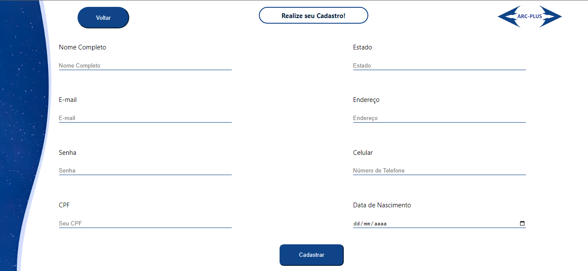
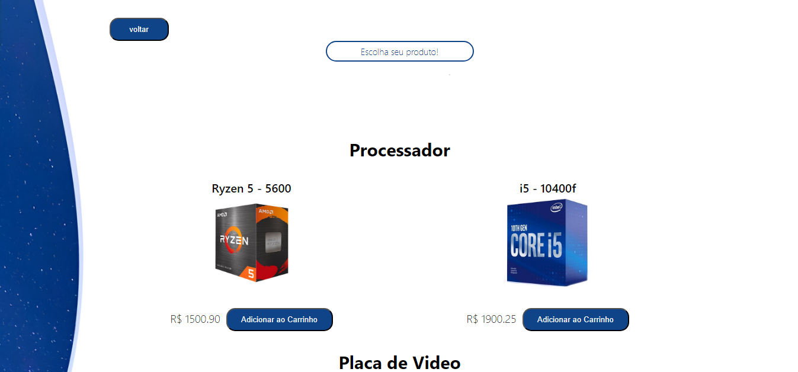

# Sobre o projeto

O Arc MarketingPlace é um projeto de um site construido com objetivo de testar o conhecimento de html, css e JavaScript

construido durante o segundo módulo da universidade unifacisa.

# Tecnologias utilizadas
- HTML
- CSS
- JavaScript

